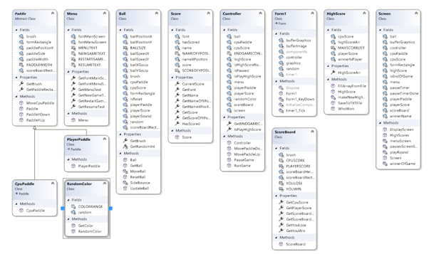

Console.Beep(); was learned from microsoft docs.
https://learn.microsoft.com/en-us/dotnet/api/system.console.beep?view=net-6.0

SoundPlayer was learned from Josh in my class.

Stream Reader and Writer, we were shown in programming 1.

Bugs:
It can give the apearance of the ball passing through the corner of the paddle when the ball is on a certain angle when the paddle is moving some times.

This Program hasn't been changed since it was submited for grading, to play the game you can find the exe file in the obj/Debug directory.